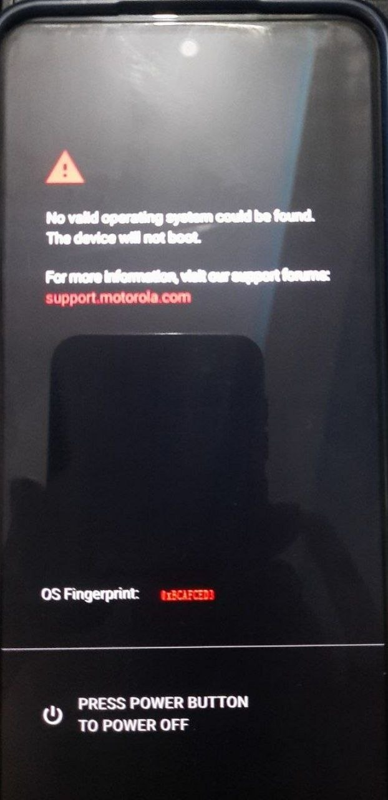

# Stock Flash File Usage Instructions

**Before you start:** 
- Read the guide carefully.
- Follow step by step top to bottom.
- This guide understands user has previous knowledge and may only provide necessary steps.
- This guide is based on windows, but general flashing instructions are same.
- Remember flashing carries risk and this guide or maker won't be liable for damage or mishap happened.

## Anti-Rollback (ARB)
It is simply put a mechanism to prevent flashing old firmware.

Respective to G54:
* **Pre-ARB:** Before May A14 update → can downgrade only till A13

  * Do NOT relock bootloader on A13
  * It is not recommended to lock, but can be used while unlocked

* **ARB:** Post A14 May update:

  * Supports A14 May → A15+
  * Do NOT flash below allowed ARB level or device may hard brick

## Notes
* Platform tools must be extracted inside ROM folder or set in environment PATH
* Use appropriate flash file for flashing
* Install drivers if needed:
  [Motorola Official Drivers](https://motorola-global-portal.custhelp.com/euf/assets/downloads/Motorola_Mobile_Drivers_64bit.msi)

## Requirements

* Stock ROM downloaded on PC
* Flash files added inside Extracted ROM folder
* Ensure Usb Debugging enabled in devloper option
* Motorola Official drivers installed
* Platform tools extracted in ROM folder or set in system PATH
* Ensure Device is detected in bootloader mode

## Flashing Steps

* Extract stock ROM on PC and place flash file inside it
* Ensure device is connected and detected in bootloader

  * If not detected, install motorola drivers and restart pc

* Flash using correct `flashfile.bat`:

  * A14 → use A14 flashfile
  * A15 → use A15 flashfile

* Match ROM version with correct **ARB level**
* Be inside ROM folder and check device connected
* Double click on flashfile to start flashing
  * You can mannualy flash files with fastboot too
* After flashing done
  * Navigate in bootloder
  * select **Reboot to Recovery**
  * Click Power Button to confirm

* Booted into stock recovery
* If dead Android screen appears:

  * **Hold Power + tap Volume Up once**
  * It will boot yout to true recovery

* In true recovery:

  * Navigate with volume keys
  * Select **Wipe/Format Data → Yes**

* Reboot to system
* Should be now succesfully booted

## First Boot Setup

* Complete setup with minimal internet
* Turn off **Smart Updates in toggle** during setup
* Disconnect internet after setup
* Turn on devloper option
  * Enable **USB Debugging**
  * Ensure **OEM Unlocking should be ON and greyed out**

## Relock Bootloader

* Boot to bootloader
* Run:

  ```
  fastboot oem lock
  ```
* In Phone Screen select lock/yes
* After lock done, From bootloder boot into recovery
* Wipe data again
* Reboot to system

## If Stuck on “OS Not Found”


---
* Press Power button from that screen to Power Off
* Boot to bootloader
* Re-flash same stock ROM using flashfile
* Ensure correct ARB rules
* Reboot to system (skip wipe this time)
* Skip setup as much as possible
* Go back to bootloader → recovery → wipe data
* Reboot normally

## Final Steps

* Complete setup
* Go to Developer Options
* OEM Unlocking can now be disabled and not greyed out
* After toggle disable reboot to activate security by motorola
* Enjoy Device is locked
* To fill both slots do OTA once

# License

SPDX-License-Identifier: MIT

```
MIT License

Copyright (c) 2026 Noname Blank <nonameblank007@gmail.com>

Permission is hereby granted, free of charge, to any person obtaining a copy
of this software and associated documentation files (the "Software"), to deal
in the Software without restriction, including without limitation the rights
to use, copy, modify, merge, publish, distribute, sublicense, and/or sell
copies of the Software, and to permit persons to whom the Software is
furnished to do so, subject to the following conditions:

The above copyright notice and this permission notice shall be included in all
copies or substantial portions of the Software.
```
Read Full LIcense: [Link](LICENSE)