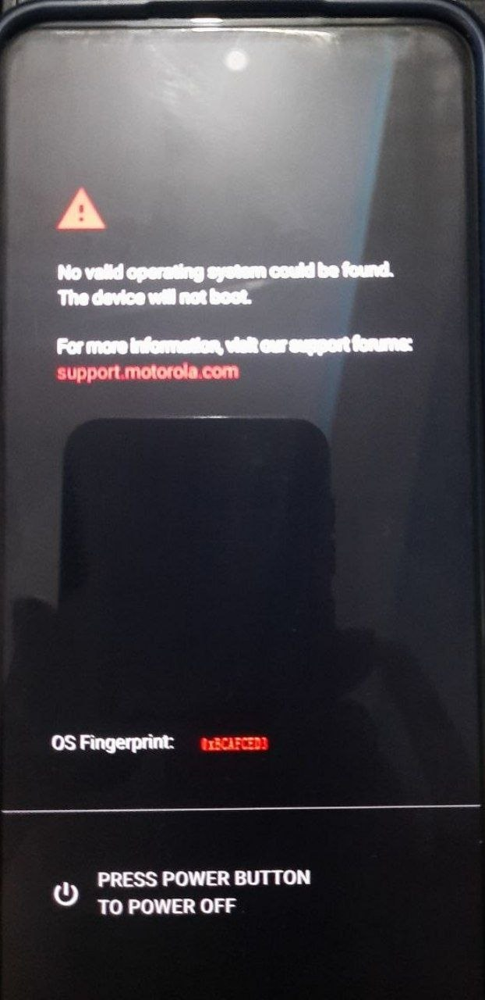

# Stock Flash File Usage Instructions

**Before you start:** 
- Read the guide carefully.
- Follow step by step top to bottom.
- This guide understands user has previous knowledge and may only provide necessary steps.
- This guide is based on windows, but general flashing instructions are same.
- Remember flashing carries risk and this guide or maker won't be liable for damage or mishap happened.

## Anti-Rollback (ARB)
It is simply put a mechanism to prevent flashing old firmware.

Respective to G54:
* **Pre-ARB:** Before May A14 update → can downgrade only till A13

  * **Do NOT** relock bootloader on A13
  * It is not recommended to lock, but can be used while unlocked

* **ARB:** Post A14 May update:

  * Supports A14 May → A15+
  * **Do NOT** flash below allowed ARB level or device **will hardbrick**

* **ARB V2:** Post A15 September patch
  * September patch [V1TDS35H.83-20-5-14, V1TDS35H.83-20-5-8-2-1-3]
  * If device is above or on the patch **DO NOT** flash below it or A14 builds of stock rom or **it will hardbrick**

Respective to G64:
* **Pre-ARB:** Before May A14 update

  * **Do NOT** attempt to flash A13, as it didn't ship with fw below A14 like G54
  * Anything below A14 may will work if pre-arb

* **ARB:** Post A14 May update:

  * Supports A14 May → A15+
  * **Do NOT** flash below allowed ARB level or device **will hardbrick**

* **ARB V2:** Post A15 September patch
  * September patch [V1TDS35H.83-20-5-14, V1TDS35H.83-20-5-8-2-1-3]
  * If device is above or on the patch **DO NOT** flash below it or A14 builds of stock rom or **it will hardbrick**

## Check ARB

* Check ARB for Cancunf devices
* Run:

  ```
  fastboot getvar version-bootloader
  ```
* Output as example:

  ```
  - version-bootloader[0]: MBM-3.1-cancunf_g_vext-ab328de212-24
  - version-bootloader[1]: 1234-U1TDS34.94-12-7-2-a1234b
  ```
* If number between ```U1TDS34.94-12-7``` -> ```U1TDS34.94-12-7-2```:
  * Pre-ARB
* If ```U1TDS34.94-12-7-5```, ```V1TD35H.83_20_5``` or above it:
  * ARB
  * ARB V2

## Notes
* Platform tools must be extracted inside ROM folder or set in environment PATH
  * Downloaded ROM you want to flash should be 2-3 builds older than version you want on stock, It is to ensure you have backup for pre-flash validation error and able to OTA update to fill slots, when you boot.
  * It is better to OTA to version you want to stay stock on than direct flashing.
    * Example: Target to be on stock: ```U1TDS34.94-12-9-10-2``` last ARB update for A14. So, use ```U1TDS34.94-12-9-10``` or ```U1TDS34.94-12-7-7``` to flash
    * It is recommended, But fine if you can't find 2-3 OTA older builds. Just ensure [you meet this slot requirment](#relock-bootloader) before lock.
      * Ensure device Boots from Slot A.
    * Remember to be always under ARB rules
* Use appropriate flash file for flashing from release: [Link](https://github.com/NonameBlank007/Cancunf_Stock_Flash_Guide/releases/tag/cancunf_flash_files)
* Install drivers if needed:
  [Motorola Official Drivers](https://motorola-global-portal.custhelp.com/euf/assets/downloads/Motorola_Mobile_Drivers_64bit.msi)

## Requirements

* Stock ROM downloaded on PC
* Flash files added inside Extracted ROM folder
* Ensure Usb Debugging enabled in devloper option
* Motorola Official drivers installed
* Platform tools extracted in ROM folder or set in system PATH
* Ensure Device is detected in bootloader mode

## Flashing Steps

* Extract stock ROM on PC
* Place extracted flash file inside the ROM folder
* Ensure device is connected and detected in bootloader

  * If not detected, install motorola drivers and restart pc

* Flash using correct `flash_file.bat`:

  * A13 → use A13 flash_file-A13
  * A14 → use A14 flash_file-A14
  * A15 → use A15 flash_file-A15

* Match ROM version with correct **ARB level**
* Be inside ROM folder and check device connected
* Double click on ```flash_file.bat``` to start flashing
  * You can mannualy flash files with fastboot too
* After flashing done
  * Navigate in bootloder
  * select **Reboot to Recovery**
  * Click Power Button to confirm

* Booted into stock recovery
* If dead Android screen appears:

  * **Hold Power + tap Volume Up once**
  * It will boot you to true recovery

* In true recovery:

  * Navigate with volume keys
  * Select **Wipe/Format Data → Yes**

* Reboot to system
* Should be now succesfully booted

## First Boot Setup

* Complete setup with minimal internet
* Turn off **Smart Updates in toggle** during setup
* Disconnect internet after setup
* Turn on devloper option
  * Enable **USB Debugging**
  * Ensure **OEM Unlocking should be ON and greyed out**
  * If button is greyed out but not toggled ON, It's not a concern if device is unlocked.

## Relock Bootloader

* Boot to bootloader on stock
* Check current slot, Run:
  
  ```
  fastboot getvar current-slot
  ```
* Output if:
  
  ```
  current-slot: b
  ```
  * Option a: Power on device and do OTA to make current-slot: a
  * Option b: If you dont want to OTA, flash same build again
  * Then after proceed to locking
* Output if:

  ```
  current-slot: a
  ```
  * Proceed to lock

* To lock, Run:

  ```
  fastboot oem lock
  ```
* In Phone Screen select lock/yes
  * navigate with volume keys and power button to enter.
* After lock done, From bootloder boot into recovery
* Wipe data again
* Reboot to system

## If Stuck on “OS Not Found”


---
* Press Power button from that screen to Power Off
* Boot to bootloader
* Re-flash same stock ROM using flash_file
  * If you get pre-flash validation failed, reboot to bootloader again and try again
  * If still same, flash a newer build than current rom
* Ensure correct ARB rules
* Reboot to system (skip wipe this time)
* Skip setup as much as possible
* Go back to bootloader → recovery → wipe data
* Reboot normally

## Final Steps

* Complete setup
* Go to Developer Options
* OEM Unlocking can now be disabled
* Disable oem unlocking and reboot
* Enjoy Device is now locked
* To fill both slots do OTA once
  * If you did before for locking bootloder, Then **skip**

# License

SPDX-License-Identifier: MIT

```
MIT License

Copyright (c) 2026 Noname Blank <nonameblank007@gmail.com>

Permission is hereby granted, free of charge, to any person obtaining a copy
of this software and associated documentation files (the "Software"), to deal
in the Software without restriction, including without limitation the rights
to use, copy, modify, merge, publish, distribute, sublicense, and/or sell
copies of the Software, and to permit persons to whom the Software is
furnished to do so, subject to the following conditions:

The above copyright notice and this permission notice shall be included in all
copies or substantial portions of the Software.
```
Read Full LIcense: [Link](LICENSE)

# Credit
* Thanks [Arpit Jaiswal](https://github.com/arpiitjaiswal) for helping with flash instructions and providing flash files
